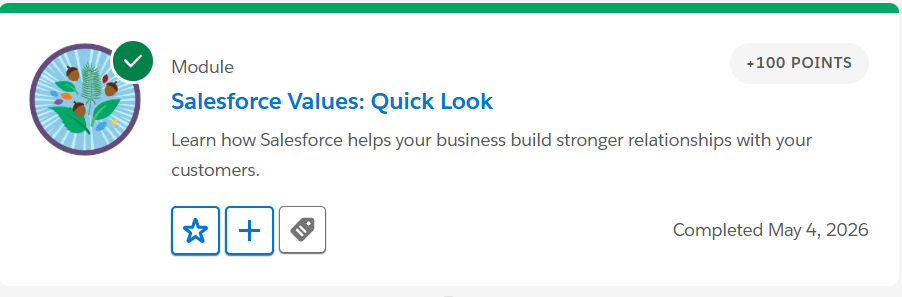

# Day 1 - CRM Basics

## What is CRM

CRM stands for Customer Relationship Management. It is a technology used by companies to manage their interactions and relationships with customers. CRM helps businesses store customer information, track communication, manage sales activities, and provide better customer service.

---

## Why Companies Use Salesforce

Companies use Salesforce because it is a powerful cloud-based CRM platform that helps businesses improve customer relationships and business operations. Salesforce allows organizations to manage customer data securely, automate business processes, track sales pipelines, improve customer support, and generate reports for better decision-making.

---

## Salesforce Terms

### Account
An Account represents a company, organization, or business that a company is working with. In Salesforce, all business related information about a company is stored inside the account.

### Contact
A Contact represents a person associated with an Account. Contacts usually include customer details such as name, email, phone number, and designation.

### Opportunity
An Opportunity represents a potential sales deal or business deal that a company is trying to close. It contains information related to the product or service being sold, deal amount, and sales stage.

---

# Core Task 1: Business Flow

## Lead → Contact → Opportunity → Customer

The business process in Salesforce usually starts with a Lead. A Lead is a person who shows interest in a product or service but is not yet confirmed as a customer. For example, a person filling out a form on a company website can be considered a Lead.

Once the sales team communicates with the lead and confirms that the person is genuinely interested, the lead is converted into a Contact. A Contact contains the verified details of the person.

After that, an Opportunity is created. An Opportunity represents a possible business deal or sales deal between the company and the customer. The sales team works on the opportunity to close the deal successfully.

When the deal is completed successfully and the customer purchases the product or service, the person officially becomes a Customer.

---

# Core Task 2: Real-Life Mapping (College Admission Example)

- Account = College
- Contact = Student
- Lead = Student inquiry about admission
- Opportunity = Admission process or fee payment process

In this example, the college acts as the Account because it is the organization. A student who contacts the college becomes a Lead initially. After confirming interest and collecting student details, the student becomes a Contact. The admission process then becomes an Opportunity because it represents a possible successful admission.

---

# Trailhead Modules Completed

1. Salesforce Values: Quick Look  
2. Salesforce Developer: Quick Look  
3. Trailhead Playground Management
4. Salesforce CRM 

---

# Screenshots

## Salesforce Values Quick Look

## Salesforce Developer Quick Look

## Trailhead Playground Management

## Salesforce CRM

