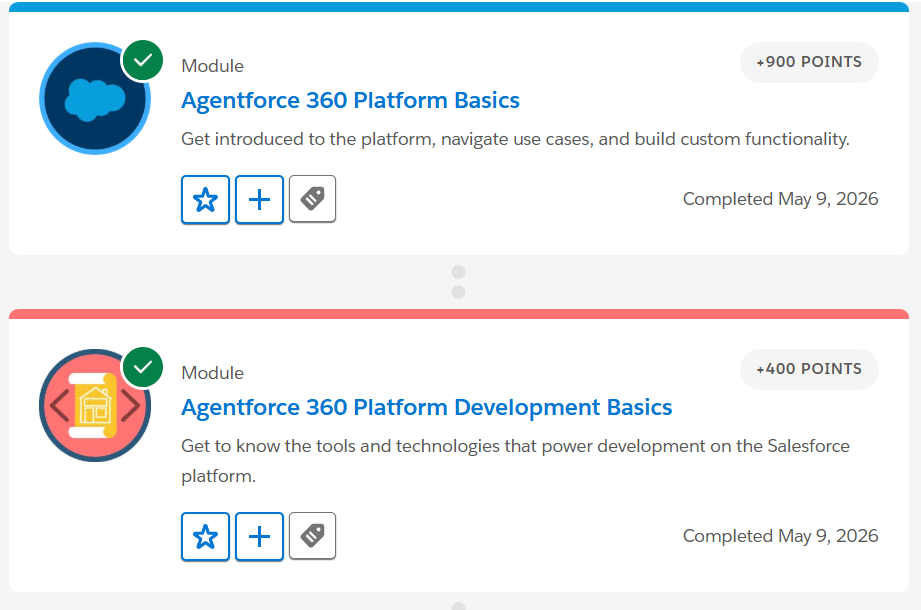
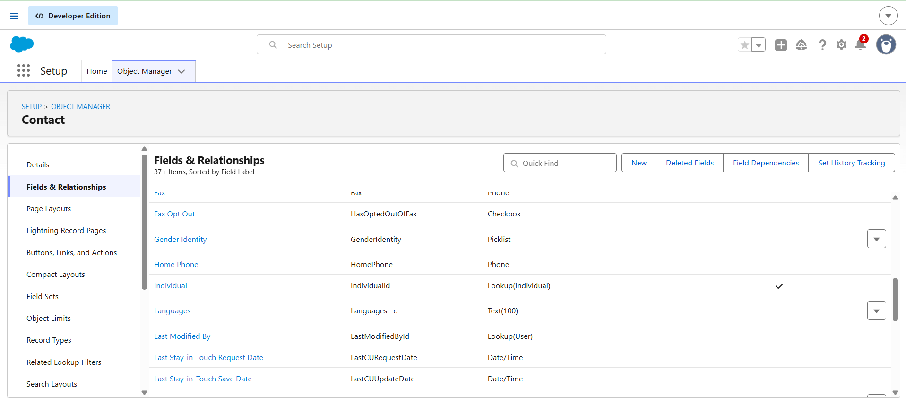
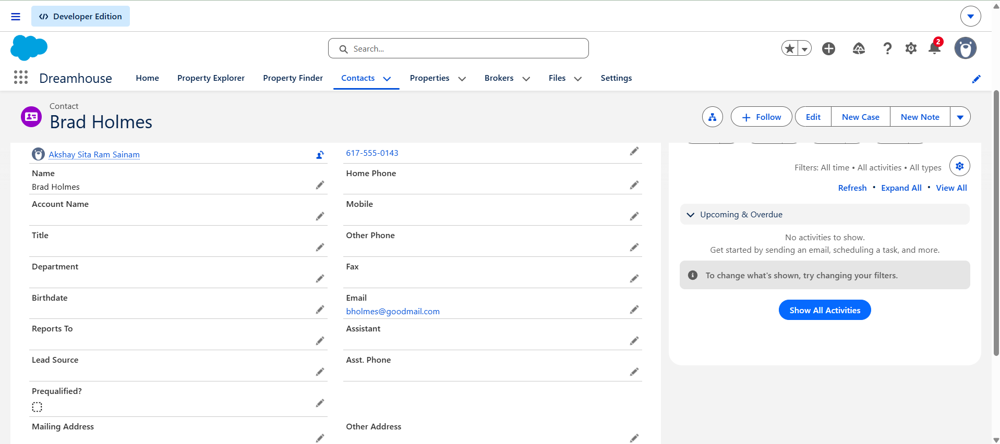

# Day 2 - Salesforce Platform Basics

## What is Salesforce Platform?

Salesforce Platform is a cloud-based platform used to build and customize business applications. It helps companies manage customer data, automate work, and improve business processes. Salesforce provides many tools that help admins and developers create applications easily. It also supports both no-code and coding development.

---

# Salesforce Platform Concepts

## What is an App?

An App in Salesforce is a collection of related tabs, objects, and features used for a particular business work. Different departments can use different apps according to their needs. 

For example, the Sales app contains Accounts, Contacts, and Opportunities for managing customer and sales information.

---

## What is an Object?

An Object in Salesforce is used to store data. It is similar to a table in a database. Objects contain records and fields. Salesforce has standard objects already available, and users can also create custom objects.

Examples:
- Account
- Contact
- Opportunity

---

## What is a Tab?

A Tab is used to open and access objects or features in Salesforce. Tabs help users navigate easily inside the application.

For example:
The Accounts tab is used to open Account records.

---

# Difference Between Configuration and Coding

## Configuration (No-Code)

Configuration means customizing Salesforce without writing code. It uses clicks and drag-and-drop tools.

Examples:
1. Creating fields using Object Manager
2. Creating automation using Flow Builder

Configuration is easier and faster for simple business requirements.

---

## Coding (Apex)

Coding is used when business requirements are more complex and cannot be done using configuration tools.

Examples:
1. Writing Apex triggers
2. Building custom UI using Lightning Web Components

Coding gives more flexibility and advanced functionality.

---

# Connecting CRM with Salesforce Platform

CRM concepts like Account, Contact, and Opportunity are stored as objects inside Salesforce apps. These objects help companies manage customer information and business activities in one platform.

Example:
- Account = Company
- Contact = Person
- Opportunity = Business deal

---

# System Design Example

## App Name
College Management App

## Objects Inside the App
- Student
- Faculty
- Course
- Admission
- Fees

## User Interaction

Students can apply for admission and view course details. Faculty can manage student information and attendance. Admin users can manage admissions and fee details using the Salesforce application.

---

# Multi-Tenant Architecture

Multi-tenant architecture means many companies use the same Salesforce servers and infrastructure, but their data is stored separately and securely. It is similar to many families living in different apartments inside the same building.

---

# How Salesforce Extends Functionality

Salesforce allows developers to extend functionality using:
- Apex
- Lightning Web Components
- APIs
- AppExchange apps
- Flow Builder

These tools help developers create advanced business solutions.

---

# Trailhead Modules Completed

1. Agentforce 360 Platform Basics
2. Agentforce 360 Platform Development Basics

---

# Screenshots

## Agentforce 360 Platform Basics & Agentforce 360 Platform Development Basics

## Trailhead lab

