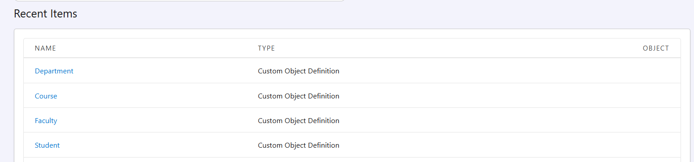
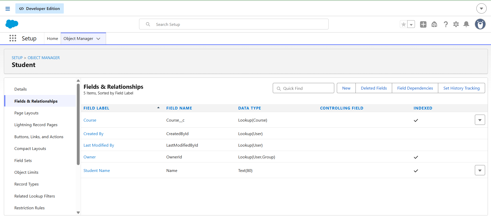
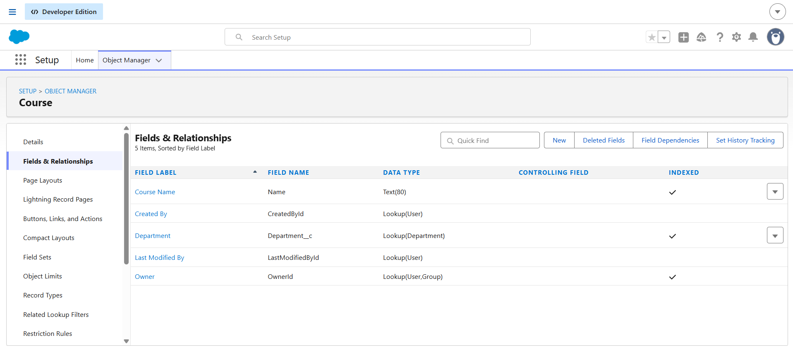
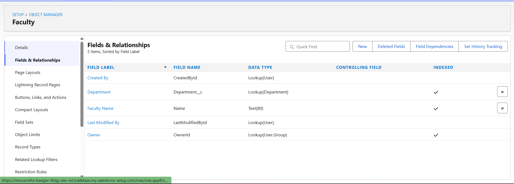
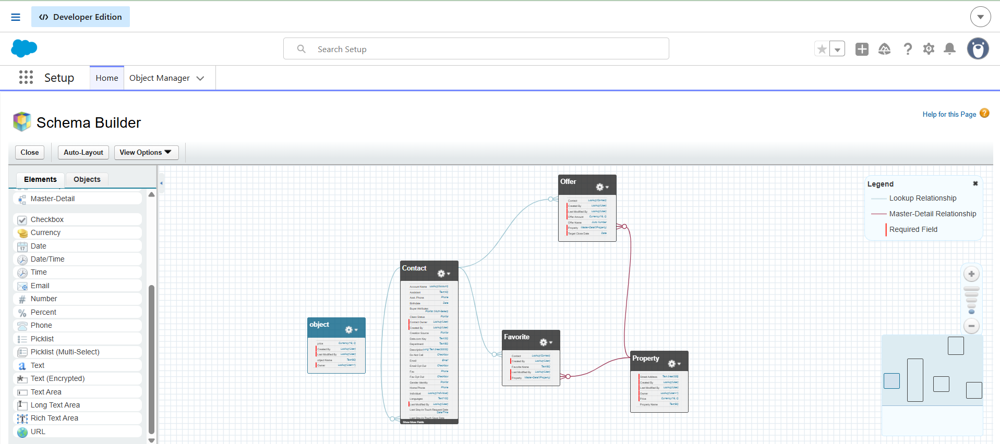
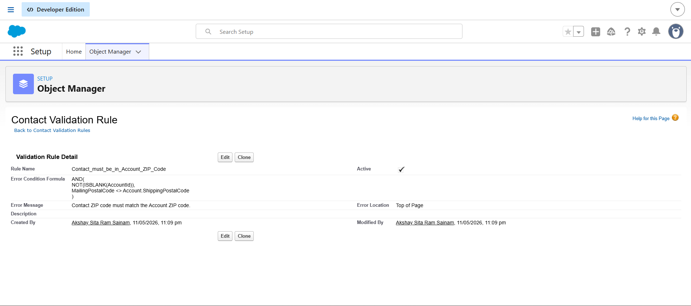
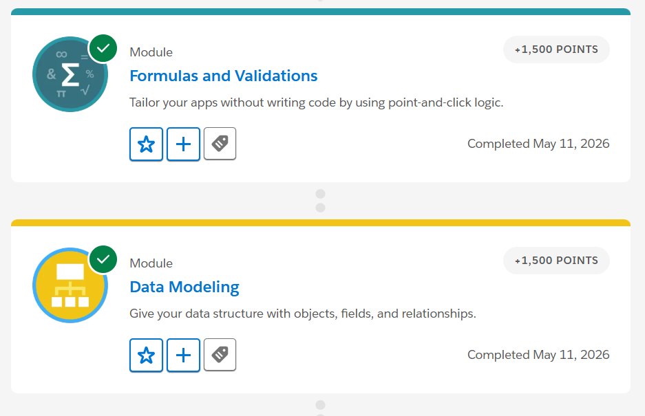

# Day 3 - Data Modeling

## Introduction

Today, I learned how Salesforce stores and manages business data using objects, fields, records, relationships, formula fields, and validation rules. I created a simple College Management System data model and understood how enterprise applications organize data in a structured way.

# Difference Between App, Object, Record, and Field

## App
An App in Salesforce is a collection of related objects, tabs, and features used for a specific business purpose. Different departments use different apps according to their work. For example, a College Management App can contain Student, Faculty, Course, and Department objects.

## Object
An Object is used to store data in Salesforce. It is similar to a table in a database. Objects contain records and fields. Salesforce provides standard objects by default, and users can also create custom objects.

Examples:
- Student
- Faculty
- Course
- Department

## Record
A Record is a single entry inside an object. Each record stores information about one item.

Example:
A student named Ram inside the Student object is one record.

## Field
A Field stores a specific piece of information inside a record.

Examples:
- Student Name
- Email
- Phone Number
- Course Name

# Standard vs Custom Objects

## Standard Objects
Standard Objects are already available in Salesforce and are mainly used for CRM processes.

Examples:
- Account
- Contact
- Opportunity

## Custom Objects
Custom Objects are created by users according to business requirements. These objects are not available by default.

Examples:
- Student
- Faculty
- Course
- Department

# College Management System Data Model

For this task, I created a simple College Management System using custom objects.

## Objects Created
- Student
- Faculty
- Course
- Department

# Relationships Between Objects

The objects are connected using Lookup Relationships.

- One Course can have many Students.
- One Department can have many Courses.
- One Department can have many Faculty members.

Relationships created:
- Student → Course
- Course → Department
- Faculty → Department

These relationships help connect related data properly and avoid duplicate information.

# Formula Fields

## 1. Full Name

This formula combines First Name and Last Name automatically. It reduces manual work and avoids typing mistakes.

Example Formula:
First_Name__c & " " & Last_Name__c

## 2. Remaining Seats

This formula calculates remaining seats automatically using total seats and filled seats. It helps users quickly know seat availability.

Example Formula:
Total_Seats__c - Filled_Seats__c

## 3. Percentage

This formula calculates student percentage automatically using marks obtained and total marks. It saves time and reduces calculation errors.

Example Formula:
(Obtained_Marks__c / Total_Marks__c) * 100

# Validation Rules

## 1. Email Cannot Be Empty

This validation rule prevents users from saving student records without email information. It helps maintain complete student data.

Example Condition:
Email field should not be blank.

## 2. Student Age Cannot Be Negative

This validation rule prevents invalid negative age values from being entered into the system.

Example Condition:
Age__c < 0

## 3. Course Seats Cannot Exceed Limit

This validation rule prevents adding more students than the maximum seat capacity of a course.

Example Condition:
Filled_Seats__c > Total_Seats__c

# Reflection

Companies cannot manage everything using random Excel sheets because large amounts of data become difficult to organize and maintain. Different departments need connected and accurate data to work properly. Relationships between objects help companies connect related information in a structured way. Formula fields automate calculations and reduce manual work. Validation rules help prevent wrong or invalid data from entering the system. Structured enterprise systems improve data quality, efficiency, and reliability.

# Reflective Questions

## 1. Why can’t companies manage everything using Excel sheets?
Excel sheets become difficult to manage when data grows very large. Data can become duplicated, inconsistent, and difficult to track across departments.

## 2. Why are relationships important between objects?
Relationships help connect related data properly. They allow different objects to work together in a structured system.

## 3. What problems happen if data is inconsistent?
Inconsistent data can create confusion, wrong reports, duplicate records, and business errors.

## 4. Why should repetitive calculations be automated?
Automation saves time, reduces manual work, and avoids calculation mistakes.

## 5. Why should invalid data be blocked early?
Blocking invalid data early helps maintain clean and accurate records inside the system.

## 6. Why is Salesforce called a metadata-driven platform?
Salesforce is called a metadata-driven platform because most customizations are created using configuration instead of traditional coding.

# Screenshots

## Object Created

---

## Student → Course Relationship

---

## Course → Department Relationship

---

## Faculty → Department Relationship

---

## Schema Builder

---

## Validation Rules

---

## Data Modeling & Formulas and Validations Modules

