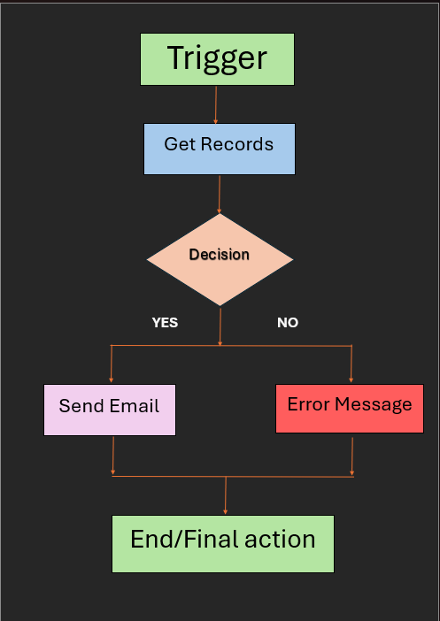
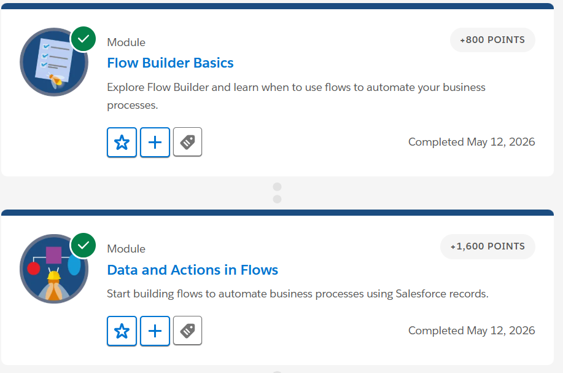
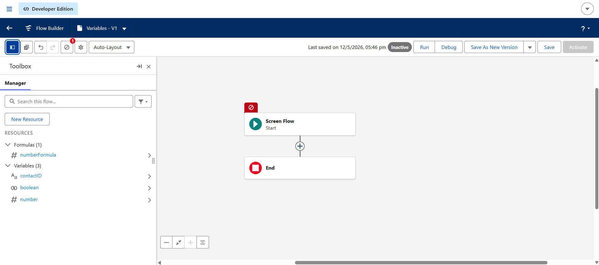
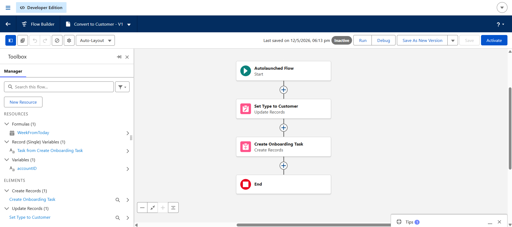
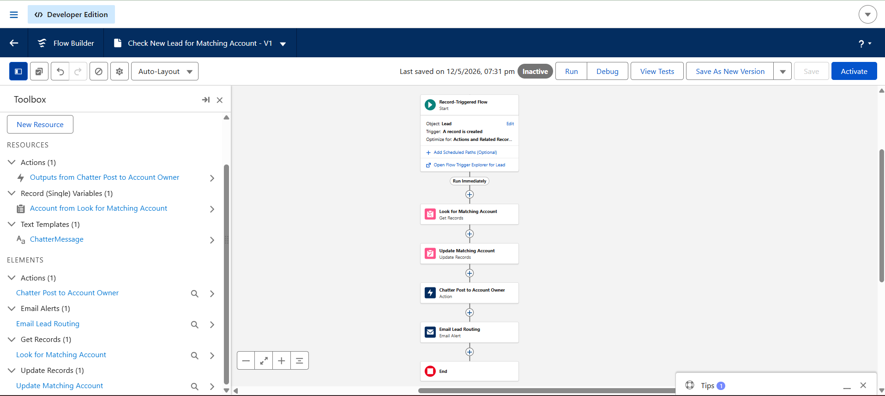

# Day 4 - Flow Builder and Automation

# What is Flow Builder?

Flow Builder is a no-code automation tool available in Salesforce. It helps users automate business processes using drag-and-drop elements instead of programming. Companies use Flow Builder to automate repetitive tasks and reduce manual work.

Flow Builder can:
- create records automatically
- update records
- send emails
- make decisions
- show screens to users
- automate workflows

Flow Builder is very useful because it saves time, improves consistency, and reduces human errors. Modern companies use automation heavily to improve business efficiency.

# Types of Flows

## Screen Flow

Screen Flow is used when user interaction is required. It shows screens and asks users to enter information. It works like a form or guided process inside Salesforce.

Example:
A student registration form where students enter their details and course information.

Screen Flows are useful when users need to provide input during the process.

## Record-Triggered Flow

Record-Triggered Flow runs automatically when a Salesforce record is created, updated, or deleted. It works completely in the background without user interaction.

Example:
When a student successfully registers for a course, Salesforce automatically sends a confirmation email.

Record-Triggered Flows help automate repetitive business processes automatically.

# Automation Ideas for College Management System

## 1. Auto Email After Student Registration

When a student registers for a course, Salesforce can automatically send a confirmation email containing course details and registration information.

This automation helps reduce manual communication work and improves student experience.

## 2. Auto Update Remaining Seats

When a new student joins a course, Salesforce can automatically reduce the number of available seats.

This automation helps maintain accurate course availability information and avoids seat calculation mistakes.

## 3. Notify Faculty When Course is Full

When all seats in a course become full, Salesforce can automatically notify the faculty member.

This automation helps faculty members quickly manage admissions and course planning.

## 4. Generate Student ID Automatically

When a new student record is created, Salesforce can automatically generate a unique student ID number.

This automation reduces manual work and avoids duplicate or incorrect student IDs.

## 5. Send Reminder Before Fee Deadline

Salesforce can automatically send reminder emails before the student fee payment deadline.

This automation improves fee payment tracking and helps students avoid missing deadlines.

# Flow Design Thinking

## Selected Automation Process

Auto Email After Student Registration

This automation automatically sends a confirmation email after a student successfully registers for a course.

# Flow Process

This flow automatically starts when a student registration record is created. The flow retrieves student and course information and checks whether the registration process is successful. If the registration is successful, Salesforce automatically sends a confirmation email to the student. If there is any issue during registration, the flow shows an error message. This automation helps reduce manual work and improves communication efficiency.

# Flow Diagram

# Manual vs Automated Process

## Process Chosen

Student Fee Reminder Process

## Manual Process

In a manual process, staff members check fee records one by one and manually send reminder emails to students before the payment deadline. This process takes a lot of time and becomes difficult when the number of students is very large.

## Problems in Manual Process

- Time consuming
- Human errors
- Some students may not receive reminders
- Difficult to manage large amounts of data
- Repetitive work for employees

## How Salesforce Automation Helps

Salesforce automation can automatically send reminder emails before the deadline using flows. Employees do not need to manually track every student. This improves productivity, saves time, reduces errors, and ensures all students receive reminders properly.

# Reflection

Companies should automate repetitive business processes because manual work takes more time and can create mistakes. Automation improves productivity, consistency, and efficiency. Employees can focus on more important tasks while Salesforce handles repetitive operations automatically.

Automation also improves customer and user experience because tasks happen faster and more accurately. Enterprise companies use automation to manage large amounts of business data and workflows efficiently.

# Reflective Questions

## 1. Why do companies automate workflows?

Companies automate workflows to reduce manual work, save time, improve productivity, and avoid human errors.

## 2. What problems happen with manual processes?

Manual processes can be slow, repetitive, inconsistent, and may create mistakes or missing records.

## 3. Difference between Screen Flow and Record-Triggered Flow?

Screen Flow requires user interaction and input, while Record-Triggered Flow runs automatically in the background when records change.

## 4. Why is no-code automation powerful?

No-code automation allows users to create business logic quickly without programming knowledge. It saves development time and makes automation easier to manage.

## 5. When should automation be avoided?

Automation should be avoided when processes require complex human judgment, approvals, or decisions that cannot be automated properly.

## 6. How does automation improve consistency and productivity?

Automation performs tasks the same way every time without forgetting steps. This improves consistency, reduces errors, and saves employee time.

# Screenshots

## Flow Builder Basics & Data and Actions in Flows Modules Completion

## Variables

## Create and Update records in flow

## Record-Triggered Flow Created in Salesforce Flow Builder

