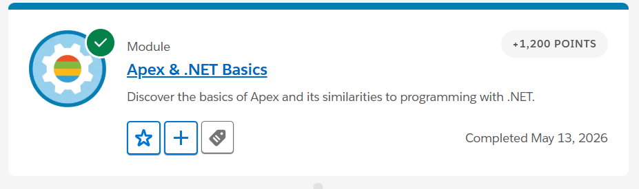
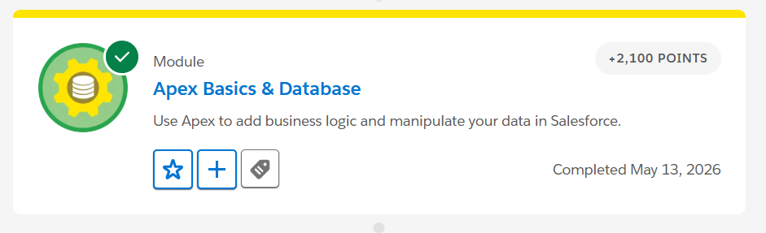
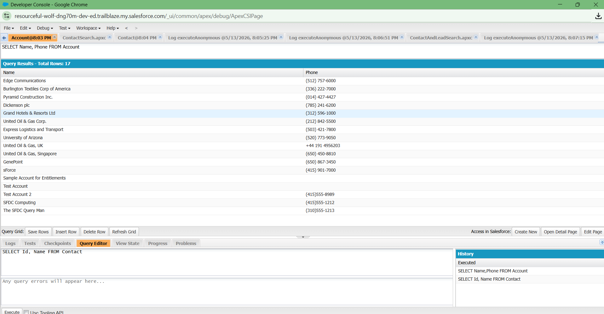
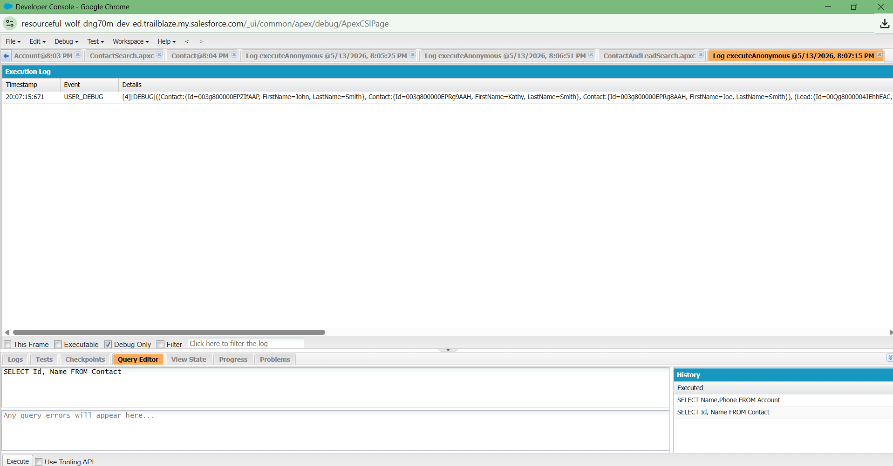
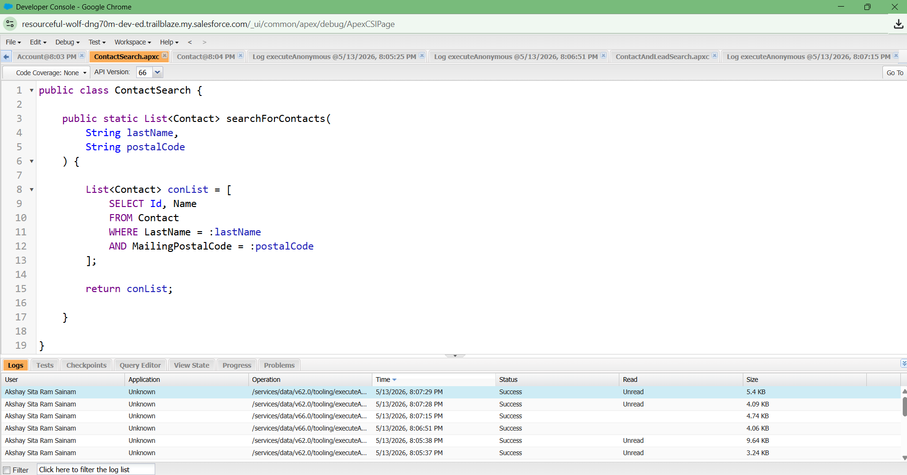

# Day 5 - Apex Introduction

## What is Apex?

Apex is a programming language in Salesforce used to create custom business logic and automation. It is similar to Java and runs on the Salesforce cloud platform.

# Difference Between Flow and Apex

## Flow
- No-code or low-code tool
- Easy to create automation
- Best for simple business logic
- Faster development

## Apex
- Programming language
- Used for complex logic
- More flexible and powerful
- Used when Flow is not enough

# Difference Between Configuration and Coding

## Configuration
- Uses clicks and setup options
- No programming required
- Easy to maintain

## Coding
- Uses Apex programming
- Handles advanced requirements
- Gives more control and flexibility

# Real Examples Where Apex Is Needed

## 1. Complex Fee Calculation
Apex is needed when fee calculation depends on scholarship, attendance, category, and discounts.

## 2. External Payment Integration
Apex is used to connect Salesforce with payment systems like Razorpay or Stripe.

## 3. Advanced Eligibility Logic
Apex is needed when student admission depends on multiple conditions and validations.

# Integrated College Management System Design

## CRM
Used to manage student admissions and student data.

## Objects
- Student
- Course
- Faculty

## Relationships
Student object is connected with Course object.

## Validation
Student email field should not be empty during registration.

## Formula
Remaining Seats = Total Seats - Filled Seats

## Flow
Automatically send admission confirmation email after registration.

## Apex
Used for custom eligibility checking and fee calculation.

# Pseudocode Examples

## Example 1
IF seats are full  
THEN block registration

## Example 2
IF attendance < 75%  
THEN notify student

## Example 3
IF fee is not paid  
THEN block exam registration

# Reflection

Enterprise systems cannot be built only with clicks and configuration because some business processes are very complex. Advanced calculations, integrations, security checks, and custom workflows require programming. Apex provides flexibility and control to build scalable enterprise applications.

# Reflective Questions

## 1. Why is Apex needed if Salesforce already has Flows?
Flows are useful for simple automation, but Apex is needed for complex business logic and integrations.

## 2. When should developers prefer no-code solutions?
Developers should prefer no-code solutions when the requirement is simple and can be handled using Flow or configuration.

## 3. What problems require custom programming?
Complex calculations, external integrations, advanced validations, and scalable automation require custom programming.

## 4. Why is business logic important in enterprise systems?
Business logic helps automate processes, improve accuracy, and maintain company rules.

## 5. Why should developers avoid unnecessary coding?
Unnecessary coding increases complexity and maintenance effort.

## 6. How does programming increase flexibility?
Programming allows developers to create custom solutions and handle advanced business requirements.

# Screenshots

## Apex & .NET Basics Module

## Apex Basics & Database Module

## Executing SOQL Queries in Salesforce Developer Console

## SOSL Search Results Using Apex Debug Logs

## Apex Class Implementation for Contact Search Using SOQL

