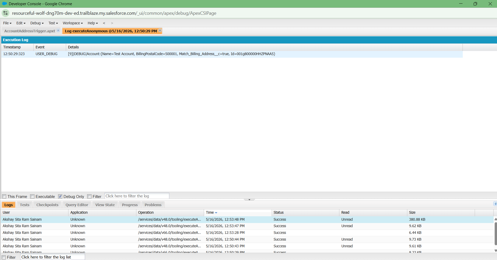
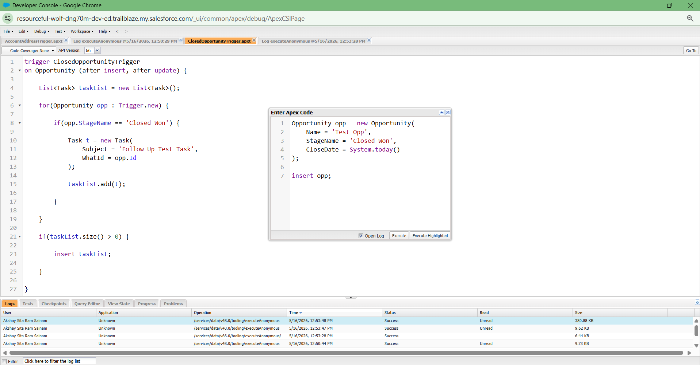
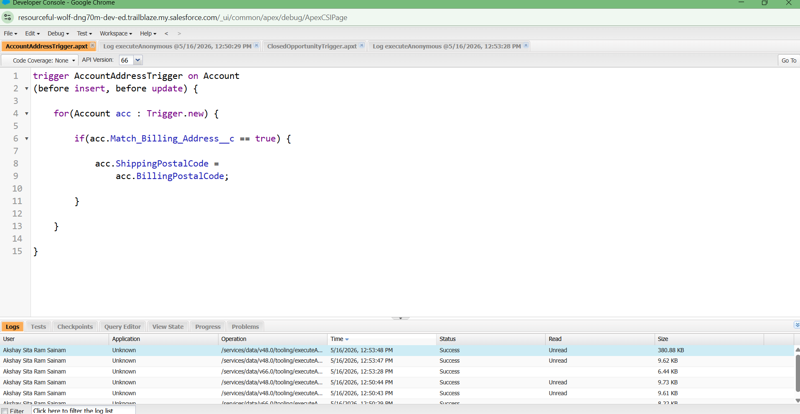

# Day 6 - SOQL and Apex Triggers

# What is SOQL?

SOQL stands for Salesforce Object Query Language. It is used to retrieve data from Salesforce objects. SOQL is similar to SQL, but instead of database tables, Salesforce uses objects like Account, Contact, Lead, and Opportunity.

SOQL helps developers:
- Find records
- Filter data
- Sort records
- Retrieve related records

Example:
- Find all students in Course A
- Find all students whose attendance is below 75%
- Find all courses handled by Faculty X

SOQL is very important because enterprise systems store huge amounts of business data.

# What is an Apex Trigger?

An Apex Trigger is Apex code that automatically runs when records are inserted, updated, deleted, or restored in Salesforce.

Triggers help Salesforce systems react automatically to business events.

Example:
- When a student registers, send a welcome email automatically.
- When attendance becomes low, send a warning notification.

Triggers are very useful for automation and business logic.

# Difference Between Flow and Trigger

## Flow
- Low-code or no-code automation tool
- Easier to create and maintain
- Best for simple automation
- Mostly used by admins

### Example
Sending a simple email notification.

## Apex Trigger
- Uses Apex programming language
- Handles complex business logic
- Better for advanced automation
- Mostly used by developers

### Example
Complex fee eligibility calculation or API integration.

# Difference Between Before Trigger and After Trigger

## Before Trigger
Runs before the record is saved in Salesforce.

Used for:
- Validations
- Updating field values before save

### Example
Automatically copying billing address to shipping address before saving the record.

## After Trigger
Runs after the record is saved.

Used for:
- Creating related records
- Sending notifications
- Updating related systems

### Example
After student registration, create a follow-up task automatically.

# Task-1: Trigger Use Cases in College Management System

## 1. Student Registration
When a student completes registration, Salesforce should automatically send a welcome email.

### Event Trigger
After Insert on Student object.

## 2. Course Full Notification
When all seats in a course become full, Salesforce should notify the faculty automatically.

### Event Trigger
After Update on Course object.

## 3. Attendance Warning
When attendance falls below 75%, Salesforce should automatically send a warning notification.

### Event Trigger
After Update on Attendance object.

## 4. Fee Payment Confirmation
When fee payment is completed successfully, Salesforce should automatically create a payment confirmation record.

### Event Trigger
After Insert on Payment object.

## 5. Hall Ticket Eligibility
If a student has unpaid fees, Salesforce should automatically block hall ticket generation.

### Event Trigger
Before Update on Student object.

# Task-2: Flow vs Trigger Thinking

## Simple Email Notification
### Best Choice: Flow
Because the logic is simple and does not require programming.

## Complex Fee Eligibility Check
### Best Choice: Apex Trigger
Because multiple conditions and calculations are involved.

## Updating Related Records
### Best Choice: Flow or Trigger
Flow works for simple updates. Trigger is better for advanced relationships and logic.

## External API Integration
### Best Choice: Apex Trigger
Because external systems and APIs require coding support.

# Task-3: Query Thinking Examples

- Find all students registered in Course A
- Find all students whose attendance is below 75%
- Find all students who did not pay fees
- Find all courses handled by Faculty X
- Find all faculty members handling more than 3 courses
- Find all newly registered students this month

These queries help organizations retrieve important information quickly.

# Task-4: Reflection

Enterprise systems need event-driven behavior because many business processes should happen automatically without manual work. Modern systems manage thousands of records every day, so automation improves speed, accuracy, and efficiency.

For example:
- Registration confirmation
- Payment notification
- Attendance warning
- Course updates

All these actions should happen automatically when data changes occur.

Event-driven systems make enterprise applications smarter and more efficient.

# Reflective Questions

## 1. Why do systems need triggers?
Triggers help systems automatically react when data changes happen.

## 2. Difference between polling and event-driven systems?
Polling continuously checks for updates, while event-driven systems react automatically when events happen.

## 3. Why are database queries important?
Queries help retrieve useful business information from large amounts of data.

## 4. When should Flows be preferred over Triggers?
Flows should be preferred for simple automation because they are easier to maintain and require less coding.

## 5. What problems happen if automation logic becomes too complex?
The system can become difficult to maintain, slower, and harder to debug.

## 6. Why should developers think carefully before automating actions?
Poor automation design can create errors, performance problems, and unnecessary processing.

## Successful Trigger Execution in Developer Console

## Bulkified Apex Trigger for Closed Opportunity Automation

## Before Insert and Before Update Apex Trigger

