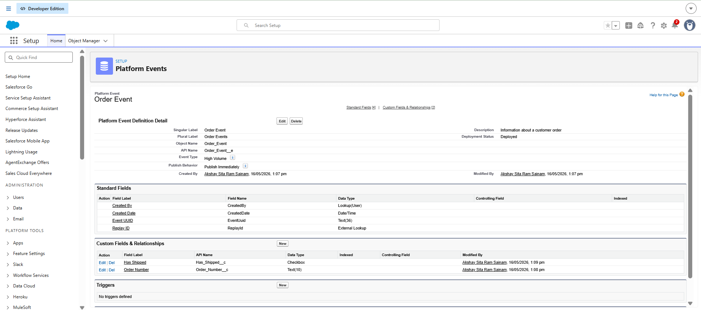
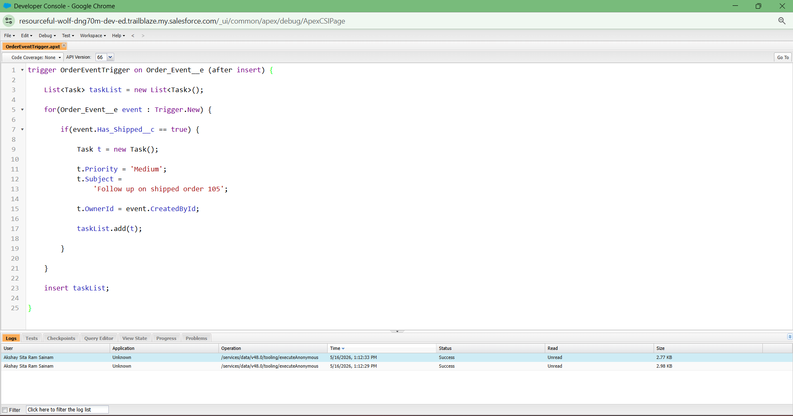

# Light Completion Day - Platform Events, Search and CLI

# One Learning From Each Module

## Search Solution Basics
I learned how Salesforce search works using search indexes and how SOQL and SOSL help retrieve records efficiently from large amounts of business data.

## Agentforce 360 Platform Events Basics
I learned how different systems communicate automatically using platform events and event-driven architecture.

## Command-Line Interface
I learned why developers use CLI tools and how command-line workflows help developers work faster and automate tasks.

# Platform Event Thinking

One real-life example of platform events is student registration in a college management system.

When a student completes registration:
- Student database gets updated
- Faculty receives notification
- Payment system receives information
- Email system sends confirmation mail

One action automatically notifies multiple systems using platform events.

# CLI Reflection

Developers prefer command-line tools because they are faster and more powerful than clicking buttons repeatedly. CLI also helps automate development tasks and improves productivity for large projects.

# Search Reflection

Fast and accurate search is very important in enterprise systems because companies store huge amounts of records and business data. Good search systems help employees quickly find correct information and improve productivity.

# What I Understood Today

Today I understood that Salesforce is not only a CRM platform but also a complete enterprise ecosystem with:
- automation
- event-driven systems
- intelligent search
- developer tools

I also learned how Salesforce communicates between systems asynchronously using platform events.

# One Doubt / Question

I understood the basics of Platform Events and CLI, but I still want to learn more about how large enterprise companies manage real-time communication between many different systems.

## Figure 1: Platform Event Configuration in Salesforce Setup

## Figure 2: Platform Event Apex Trigger in Developer Console

