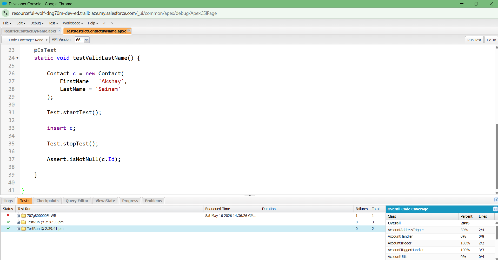
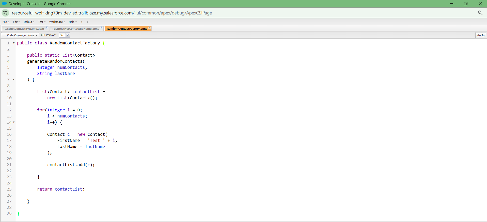
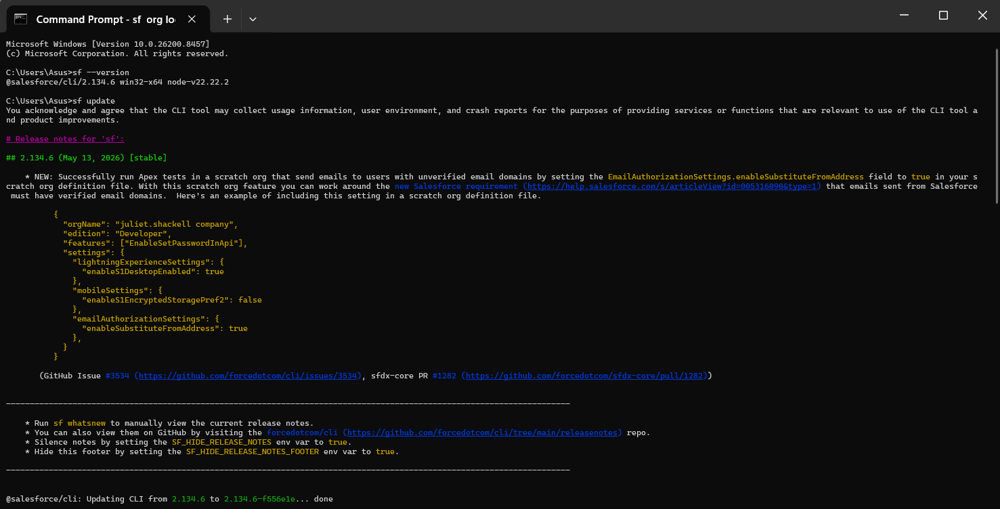
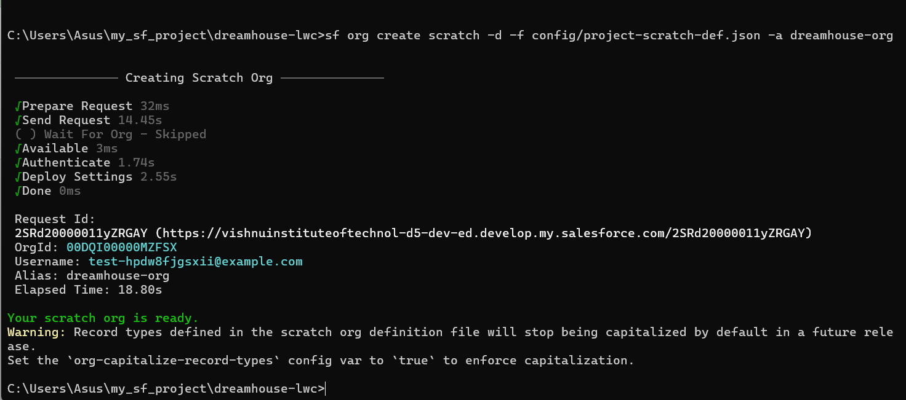
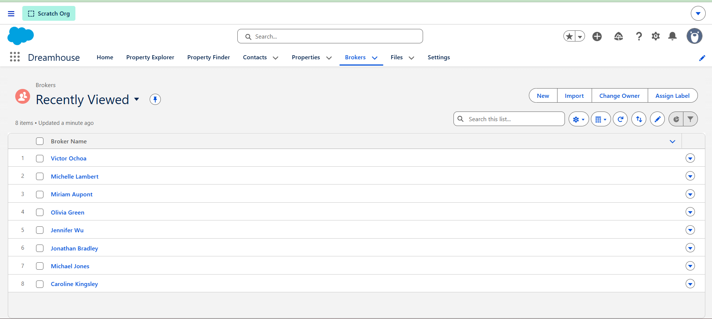

# Testing, Asynchronous Apex and Salesforce DX

# 1. Why Testing Matters

Testing is important because it helps developers find errors before the application is used by real users. In Salesforce, test classes check whether Apex code and business logic work properly.

Testing improves software quality, prevents bugs, and helps maintain system reliability. Without testing, problems like duplicate records or wrong calculations may happen.

---

# 2. What is Asynchronous Apex?

Asynchronous Apex means running processes in the background without making the user wait. It is used for heavy tasks like bulk emails, API callouts, and large data processing.

Types of Asynchronous Apex include Future Methods, Queueable Apex, Batch Apex, and Scheduled Apex.

---

# 3. What is Salesforce DX?

Salesforce DX stands for Salesforce Developer Experience. It is a modern development environment for Salesforce developers.

It helps developers use Scratch Orgs, GitHub, Salesforce CLI, and team collaboration tools. Salesforce DX improves productivity and development workflow.

# 4. Complete System Workflow

## College Management System Workflow

The complete workflow of my College Management System starts when a student registers for admission.

### Step 1: Student Registration

The student enters details like:
- Name
- Email
- Phone number
- Course selection

The information is stored inside Salesforce objects.

### Step 2: Validation Rules Check Data

Validation Rules check whether the entered data is correct or not.

Examples:
- Email should not be empty
- Phone number must contain correct digits
- Student should not register twice
- Course seats should not exceed limit

If validation fails, Salesforce shows an error message.

### Step 3: Flow Sends Confirmation

After successful registration, Salesforce Flow automatically sends:
- confirmation email
- admission notification
- success message

This improves automation and reduces manual work.

### Step 4: Trigger Updates Course Count

Apex Trigger automatically updates:
- total registered students
- remaining seats
- course status

Triggers run automatically whenever records are inserted or updated.

### Step 5: Formula Recalculates Seats

Formula fields automatically calculate:
- remaining seats
- attendance percentage
- fee balance

This keeps calculations dynamic and updated in real time.

### Step 6: Platform Event Sends Notification

Platform Events help systems communicate asynchronously.

For example:
- notification sent to faculty
- admin receives updates
- reporting system receives new data

This improves system integration.

### Step 7: Database Stores Records

All student records are stored safely inside Salesforce database objects.

Objects used:
- Student
- Course
- Faculty
- Registration

Relationships connect these objects together.

### Step 8: Reports and Dashboards Show Analytics

Salesforce Reports and Dashboards display:
- student count
- course statistics
- admission analytics
- attendance reports

Admins can monitor the system easily using reports.

# 5. Important Test Cases

## 1. Invalid Email Testing

Test:
Student enters invalid email format.

If not tested:
Wrong contact information may be stored.

## 2. Duplicate Registration Testing

Test:
Same student registers multiple times.

If not tested:
Duplicate records may create confusion.

## 3. Course Overbooking Testing

Test:
More students register after seats become full.

If not tested:
System may allow extra admissions incorrectly.

## 4. Attendance Calculation Testing

Test:
Attendance percentage calculation should be correct.

If not tested:
Wrong attendance may affect student eligibility.

## 5. Trigger Execution Testing

Test:
Apex Trigger updates remaining seats correctly.

If not tested:
Course data may become inaccurate.

# 6. Async Processing Examples

## 1. Sending Bulk Emails

Sending emails to thousands of students should happen in background processing because it takes time.

## 2. Large Report Generation

Large reports containing thousands of records should run asynchronously to avoid slowing down the system.

## 3. Data Synchronization

Synchronizing data with external systems should run in background because API communication may take time.

# 7. Reflection

Enterprise software development cannot depend only on browser clicks and manual configuration. Large applications require proper workflows, testing, version control, automation, and collaboration.

Professional developers use GitHub because it helps store source code safely and track changes. Salesforce DX helps teams follow modern development practices. CLI helps automate tasks and improve productivity.

Testing is very important because enterprise systems handle large amounts of critical business data. Without proper testing, small mistakes can create serious business problems.

Asynchronous processing improves performance and allows systems to handle heavy operations efficiently. Structured workflows help developers build scalable, reliable, and maintainable enterprise applications.

Today I understood how all Salesforce concepts like Validation Rules, Flows, Triggers, Apex, Platform Events, DX, CLI, and Testing work together to build a complete enterprise system. :contentReference[oaicite:2]{index=2}

# Screenshots

## Apex Trigger Test Class Execution

## RandomContactFactory Apex Class

## Salesforce CLI Installation and Update

## Scratch Org Creation Using Salesforce DX

## Dreamhouse Application in Scratch Org

