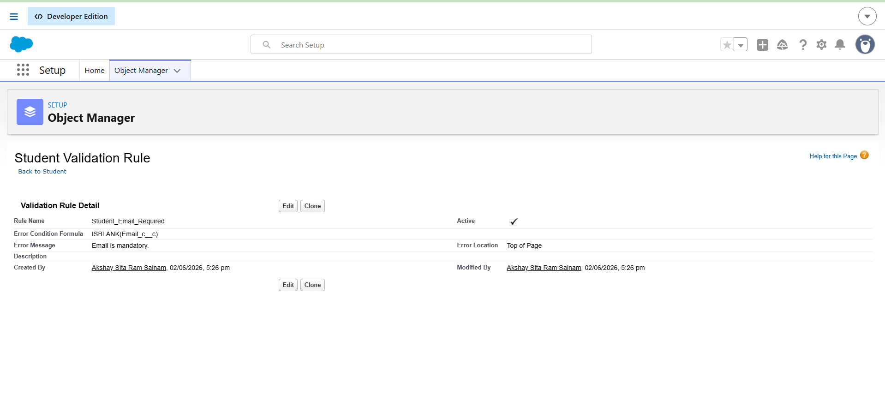
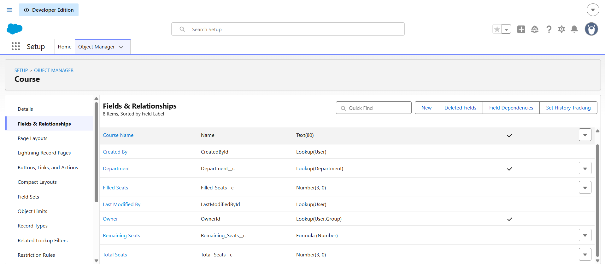
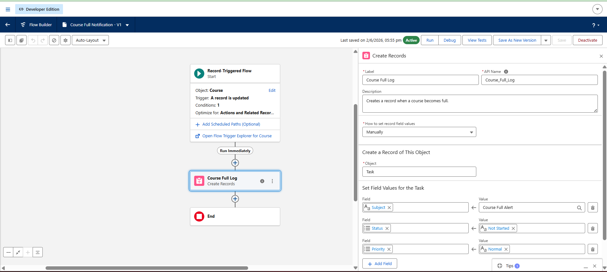

# Day 10 - College Management Mini Project

## Overview

This project is a College Management System developed using Salesforce concepts learned throughout the training. The system manages students, faculty members, courses, and departments. It demonstrates CRM concepts, data modeling, validation rules, formula fields, automation using flows, and enterprise application design.

The objective of the system is to simplify student registration, course management, faculty management, and automated notifications.


# CRM Concepts

## Student

The Student object stores information related to students.

Fields:
- Student Name
- Email
- Course

Purpose:
- Manage student details.
- Track course enrollment.


## Faculty

The Faculty object stores information related to faculty members.

Fields:
- Faculty Name
- Department

Purpose:
- Manage faculty information.
- Connect faculty members with departments.


## Course

The Course object stores information about available courses.

Fields:
- Course Name
- Total Seats
- Filled Seats
- Remaining Seats

Purpose:
- Manage course capacity.
- Track available seats.

## Department

The Department object stores department information.

Purpose:
- Organize courses and faculty members under departments.


# Data Model

## Objects Created

- Student
- Faculty
- Course
- Department


## Relationships

### Student → Course

Relationship Type:
- Lookup Relationship

Purpose:
- A student can enroll in a course.


### Faculty → Department

Relationship Type:
- Lookup Relationship

Purpose:
- A faculty member belongs to a department.


### Course → Department

Relationship Type:
- Lookup Relationship

Purpose:
- A course belongs to a department.

# Fields

## Student Object

| Field Name | Data Type |
|------------|------------|
| Student Name | Text |
| Email | Email |
| Course | Lookup(Course) |

## Faculty Object

| Field Name | Data Type |
|------------|------------|
| Faculty Name | Text |
| Department | Lookup(Department) |

## Course Object

| Field Name | Data Type |
|------------|------------|
| Course Name | Text |
| Total Seats | Number |
| Filled Seats | Number |
| Remaining Seats | Formula |

# Validation Rules

## Student Email Mandatory

Purpose:

Every student must provide an email address before the record can be saved.

Formula:

```text
ISBLANK(Email_c__c)
```

Error Message:

```text
Email is mandatory.
```

Benefits:

- Prevents incomplete records.
- Ensures students can receive notifications.

## Seats Cannot Exceed Limit

Purpose:

The number of filled seats should never exceed the total seats available for a course.

Example Formula:

```text
Filled_Seats__c > Total_Seats__c
```

Error Message:

```text
Filled seats cannot exceed total seats.
```

Benefits:

- Prevents overbooking.
- Maintains accurate course capacity.

# Formula Fields

## Remaining Seats

Purpose:

Automatically calculates available seats.

Formula:

```text
Total_Seats__c - Filled_Seats__c
```

Example:

Total Seats = 50

Filled Seats = 35

Remaining Seats = 15

## Attendance Percentage

Purpose:

Automatically calculates attendance percentage.

Formula:

```text
(Classes_Attended__c / Total_Classes__c) * 100
```

Benefits:

- Tracks student attendance.
- Helps identify low-attendance students.

# Flow Automation

## Auto Confirmation Email

Purpose:

When a student successfully registers for a course, an email confirmation can automatically be sent.

Flow Process:

1. Student registers.
2. Record is created.
3. Flow triggers.
4. Confirmation email is sent.

Benefits:

- Improves communication.
- Reduces manual work.

## Attendance Warning Flow

Purpose:

Automatically notify students when attendance falls below the required percentage.

Flow Process:

1. Attendance record updates.
2. Flow checks attendance percentage.
3. If attendance is below 75%, a warning notification is generated.

Benefits:

- Helps students improve attendance.
- Provides proactive alerts.

## Course Full Notification Flow

Implemented in Salesforce.

Purpose:

When all course seats are filled, a notification task is automatically created.

Configuration:

- Record Triggered Flow
- Object: Course
- Trigger: Record Updated

Task Created:

- Subject: Course Full Alert
- Status: Not Started
- Priority: Normal

Benefits:

- Helps administrators monitor course capacity.
- Prevents registration issues.

# Apex Logic

## Eligibility Calculation

Purpose:

Determine whether a student is eligible for a course.

Example:

- Minimum attendance requirement.
- Prerequisite course completion.

Sample Logic:

```text
If Attendance >= 75%
Allow Registration
Else
Reject Registration
```

## Bulk Operations

Purpose:

Process multiple records efficiently.

Examples:

- Bulk attendance updates.
- Bulk student imports.
- Bulk course assignments.

Benefits:

- Better performance.
- Reduced processing time.

# LWC UI Design

## Student Dashboard

Features:

- Student Profile
- Registered Courses
- Attendance Details
- Notifications
- Course Information

## Faculty Dashboard

Features:

- Faculty Profile
- Assigned Courses
- Student List
- Attendance Monitoring
- Department Details

## Registration Screen

Features:

- Student Registration Form
- Course Selection
- Validation Checks
- Registration Confirmation

# Trigger/Event Thinking

## Notify Faculty When Course Is Full

Event:

Course reaches maximum capacity.

Action:

- Flow or Trigger executes.
- Notification is sent to faculty.

Benefits:

- Faculty receives immediate updates.
- Better course management.

## Alert for Low Attendance

Event:

Attendance percentage falls below 75%.

Action:

- System generates warning.
- Student receives notification.

Benefits:

- Encourages attendance improvement.
- Helps prevent academic issues.

# Complete Data Flow

## Student Registration Process

### Step 1: Student Clicks Register

The student opens the registration page and enters details.

Information Entered:

- Student Name
- Email
- Course Selection

↓

### Step 2: LWC Registration Screen

The Lightning Web Component collects information from the student and submits it to Salesforce.

↓

### Step 3: Validation

Validation Rules verify:

- Email is provided.
- Required fields are completed.
- Course seat limits are valid.

↓

### Step 4: Flow Execution

The flow starts automatically.

The flow:

- Checks available seats.
- Verifies business rules.
- Processes registration.

↓

### Step 5: Trigger/Event

Events occur when records are created or updated.

Examples:

- Course becomes full.
- Attendance falls below limit.

↓

### Step 6: Database Update

Salesforce stores:

- Student record
- Course enrollment
- Updated seat counts

↓

### Step 7: Notification

System automatically generates:

- Confirmation emails
- Warning alerts
- Course full notifications

Final Result:

The registration process is completed successfully with automation and notifications.


# Architecture Thinking

Enterprise systems require multiple layers working together.

## Frontend

Responsibilities:

- User interaction
- Data entry
- Data display

Examples:

- Dashboards
- Forms
- Reports

## Backend

Responsibilities:

- Business logic
- Processing requests
- Executing validations

Examples:

- Apex
- Flow Logic

## Database

Responsibilities:

- Store records
- Manage relationships
- Retrieve information

Examples:

- Student Records
- Faculty Records
- Course Records

## Automation

Responsibilities:

- Reduce manual work
- Trigger actions automatically

Examples:

- Record Triggered Flows
- Scheduled Flows

## Events

Responsibilities:

- React to system changes

Examples:

- Course becomes full
- Attendance becomes low

## Why All Are Needed Together

Frontend collects data.

Backend processes data.

Database stores data.

Automation performs tasks automatically.

Events react to changes.

Together they create a complete enterprise application.

# Scaling Thinking

Suppose 50,000 students use the system.

Several challenges may occur.

## Performance Issues

Examples:

- Slow page loading.
- Large data processing.

Solution:

- Bulk processing.
- Optimized queries.

## Data Consistency Problems

Examples:

- Duplicate records.
- Incorrect updates.

Solution:

- Validation rules.
- Data quality checks.


## Notification Challenges

Examples:

- Large number of alerts.
- Delayed notifications.

Solution:

- Automated flows.
- Queue-based processing.

## Security Concerns

Examples:

- Unauthorized access.
- Data leakage.

Solution:

- Profiles
- Permission Sets
- Sharing Rules

## Storage Growth

Examples:

- Large student database.
- Increased records over time.

Solution:

- Archiving strategies.
- Efficient data management.

# Reflection

After learning Salesforce, I realized that enterprise software systems are much more than simply storing data.

A complete system requires:

- Data modeling
- Object relationships
- Validation rules
- Formula fields
- Automation
- Notifications
- Business logic
- User interfaces

I also learned how different layers of a system work together to solve real business problems.

Salesforce provides a powerful platform that allows organizations to automate processes, maintain data quality, improve productivity, and build scalable enterprise applications using both low-code and programmatic development approaches.

This project helped me understand how CRM concepts, automation, data management, and user experience combine to create real-world business solutions.


# Project Screenshots

## Objects Created


## Validation Rule



## Formula Field - Remaining Seats



## Flow Automation


