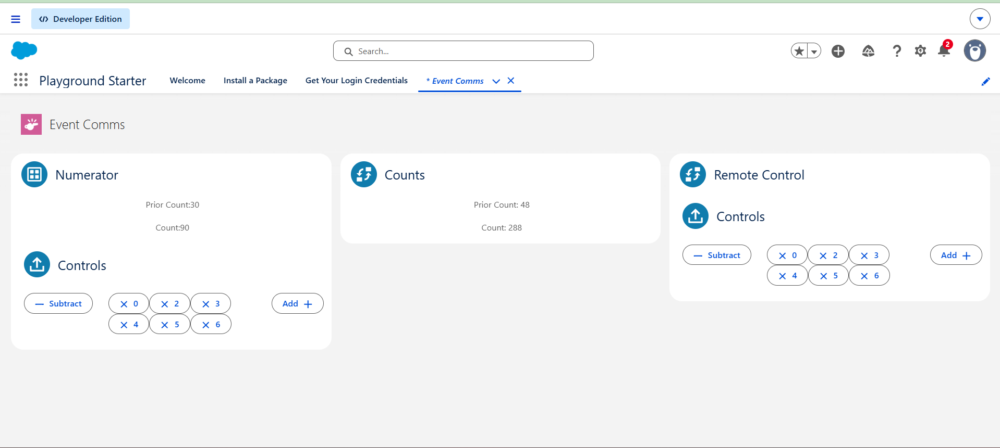
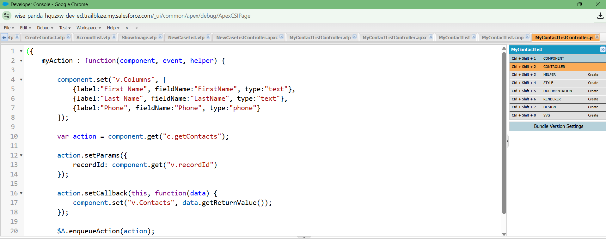

# Day 9 - LWC Communication

# 1. Dashboard Architecture

## Student Dashboard

The Student Dashboard provides students with information related to their academic activities.

### Components
- Student Profile
- Course List
- Attendance Summary
- Assignment Tracker
- Notifications

### Component Communication

- Student Profile → Course List
  - The profile component provides the student ID which is used to fetch enrolled courses.

- Course List → Assignment Tracker
  - Assignments are displayed based on the selected course.

- Attendance Summary → Student Profile
  - Attendance data is linked to the student profile.

- Notifications → Student Dashboard
  - Displays updates such as assignment deadlines and attendance alerts.


## Faculty Dashboard

The Faculty Dashboard helps instructors manage students and courses.

### Components
- Faculty Profile
- Course Management
- Attendance Management
- Student Performance
- Notifications

### Component Communication

- Course Management → Attendance Management
  - Faculty selects a course and updates attendance.

- Attendance Management → Student Performance
  - Attendance records contribute to performance evaluation.

- Notifications → Faculty Dashboard
  - Alerts faculty about important academic events.


## Admin Dashboard

The Admin Dashboard is used to manage the entire academic system.

### Components
- User Management
- Course Allocation
- Reports & Analytics
- System Monitoring
- Notifications

### Component Communication

- User Management → Course Allocation
  - Students and faculty are assigned to courses.

- Course Allocation → Reports
  - Allocation information is used to generate reports.

- Reports → System Monitoring
  - Reports help administrators track system performance.

- Notifications → Admin Dashboard
  - Displays important administrative alerts.


# 2. Data Flow Thinking

## Selected Process: Student Registration

Student registration is one of the most common processes in an educational management system.

### 1. UI Layer

The student enters information through a registration form.

**Input Fields**
- Name
- Email
- Phone Number
- Course Selection

The user clicks the Register button to submit the form.

### 2. Validation Layer

Before processing the request, the system validates:

- Required fields are filled
- Email format is correct
- Phone number is valid
- Duplicate registration does not exist

If validation fails, error messages are displayed to the user.

### 3. Flow Layer

After successful validation:

- Registration data is collected
- Business rules are applied
- The request is prepared for server-side processing

Salesforce Flow can automate many of these activities without writing code.

### 4. Apex Layer

The Apex Controller processes the request.

**Responsibilities**
- Receive registration data
- Apply business logic
- Create student records
- Handle exceptions

Apex acts as the bridge between the UI and Salesforce database.

### 5. Database Layer

The validated information is stored in Salesforce objects.

**Example Objects**
- Student
- Course
- Enrollment

The data becomes available throughout the system.

### 6. Notification Layer

After successful registration:

- Confirmation message is displayed
- Welcome email is sent
- Admin receives notification
- Student receives enrollment details

### Complete Flow Diagram

```text
Student UI
     ↓
Validation
     ↓
Flow Processing
     ↓
Apex Controller
     ↓
Salesforce Database
     ↓
Notification Service
```

# 3. Modern vs Legacy Thinking

## Why Did Salesforce Move from Visualforce/Aura to LWC?

Salesforce introduced Lightning Web Components (LWC) to improve performance and align development with modern web standards.

### Visualforce and Aura Limitations

- More framework overhead
- Slower rendering
- Complex component communication
- Less aligned with modern JavaScript standards

### Benefits of LWC

#### Better Performance
LWC uses native browser capabilities, making applications faster and more efficient.

#### Modern Standards
LWC is built using:
- HTML5
- JavaScript ES6+
- Web Components

#### Better Security
LWC works with Lightning Web Security and modern browser security features.

#### Easier Development
Developers can use standard JavaScript practices without learning many framework-specific concepts.

#### Reusability
Components can be reused across multiple applications and pages.

## Aura vs LWC Comparison

| Feature | Aura | LWC |
|----------|------|------|
| Performance | Good | Excellent |
| Framework Dependency | High | Low |
| Development Complexity | Higher | Lower |
| Web Standards | Partial | Full |
| Security | Good | Better |
| Reusability | Moderate | High |

# 4. Reflection Task

## Why Do Enterprise Applications Need Modular Architecture?

Enterprise applications are large systems that serve many users and business processes. Managing everything in a single codebase becomes difficult as the application grows.

### Benefits of Modular Architecture

#### Maintainability
Each module can be modified without affecting the entire application.

#### Reusability
Common functionality can be reused in multiple places.

#### Scalability
New features can be added easily without redesigning the whole system.

#### Team Collaboration
Different teams can work on separate modules simultaneously.

#### Easier Testing
Each module can be tested independently before integration.

#### Better Performance
Only necessary modules are loaded when required.

#### Reduced Development Time
Reusable modules speed up development and reduce effort.

# Screenshots
## Event Comms App Page


## Developer Console



